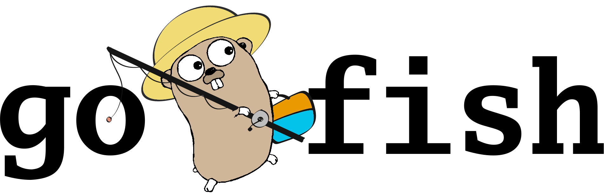

GoFish is a traffic-shaping library that allows users to introduce artifical
network latencies and irregularities to their HTTP benchmarking tools. It is
especially useful for conducting application benchmarks on localhost, where
network delays and other conditions are not present in query requests and responses.
Although it is engineered to supplement the [go2wrk benchmarking tool](https://github.com/kpister/go2wrk), GoFish
provides an easy-to-use interface for any benchmarking tool written in golang.
It draws inspiration from the [Mahimahi](http://mahimahi.mit.edu) HTTP traffic
utility (not the fish).

### TODO

* - [ ] Add usage to README
* - [ ] Look into providing tools for shaping patterns fluidly over time
    * - [ ] Binary on/off for routes over time periods
* - [ ] Allow sending requests via roundtrip to GET
* - [ ] Add response delay (and drop?)
* - [ ] TLS
    * - [ ] Port https stuff over from go2wrk
    * - [ ] Actually get the tls stuff working -- get those certs?
    * - [ ] Add to readme the steps needed for that

#### Tags
go, go2wrk, plsyssec
